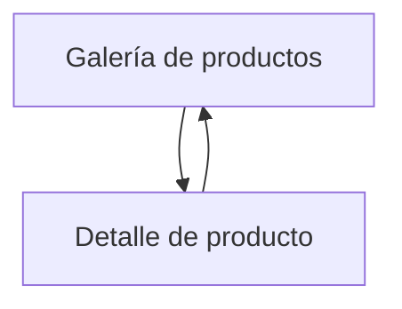

## 1. Product Overview
Galería de productos que lista productos existentes y permite abrir la vista detallada al seleccionar uno.
Enfocado en navegación simple: explorar en lista y profundizar en un producto.

## 2. Core Features

### 2.1 Feature Module
Nuestros requisitos se componen de las siguientes páginas principales:
1. **Galería de productos**: listado de productos existentes, tarjetas de producto, navegación a detalle.
2. **Detalle de producto**: vista completa del producto seleccionado, regreso a galería.

### 2.3 Page Details
| Page Name | Module Name | Feature description |
|-----------|-------------|---------------------|
| Galería de productos | Carga de productos | Obtener y mostrar productos existentes; manejar estados: cargando, error y vacío. |
| Galería de productos | Grid de tarjetas | Renderizar cada producto como tarjeta con información clave (imagen, nombre, precio); mantener tamaños consistentes. |
| Galería de productos | Selección de producto | Abrir el detalle del producto al hacer click/tap en una tarjeta; conservar el id seleccionado en la ruta. |
| Detalle de producto | Carga de detalle | Obtener el producto por id; manejar estados: cargando, error y no encontrado. |
| Detalle de producto | Presentación de información | Mostrar información completa del producto (imagen grande, nombre, precio, descripción). |
| Detalle de producto | Navegación | Permitir volver a la galería (botón “Volver” y/o breadcrumb simple). |

## 3. Core Process
**Flujo principal (usuario):**
1. Entras a la Galería de productos.
2. Ves el listado de productos existentes en tarjetas.
3. Seleccionas un producto y navegas a su detalle.
4. En el Detalle, revisas la información y vuelves a la Galería.

