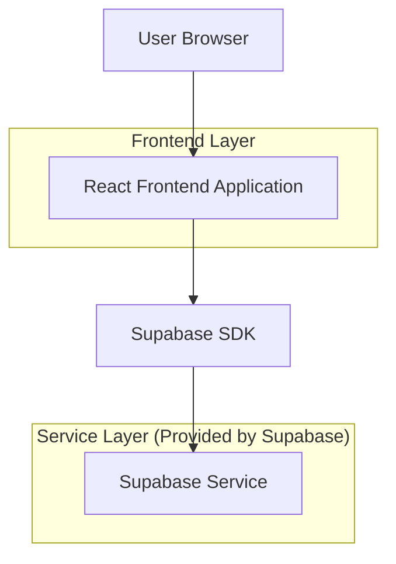
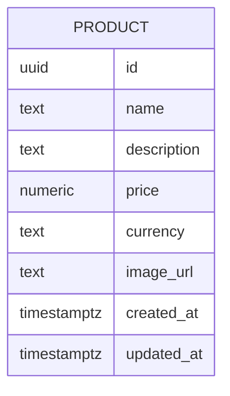

## 1.Architecture design


## 2.Technology Description
- Frontend: React@18 + react-router-dom@6 + TypeScript + vite
- Backend: Supabase (PostgreSQL + Storage opcional para imágenes)

## 3.Route definitions
| Route | Purpose |
|-------|---------|
| / | Galería de productos (listado) |
| /producto/:id | Detalle del producto seleccionado |

## 6.Data model(if applicable)

### 6.1 Data model definition


### 6.2 Data Definition Language
Products Table (products)
```sql
-- create table
CREATE TABLE products (
  id UUID PRIMARY KEY DEFAULT gen_random_uuid(),
  name TEXT NOT NULL,
  description TEXT,
  price NUMERIC(12,2) NOT NULL,
  currency TEXT NOT NULL DEFAULT 'USD',
  image_url TEXT,
  created_at TIMESTAMPTZ NOT NULL DEFAULT NOW(),
  updated_at TIMESTAMPTZ NOT NULL DEFAULT NOW()
);

-- indexes
CREATE INDEX idx_products_created_at ON products(created_at DESC);

-- permissions (per Supabase guidelines)
GRANT SELECT ON products TO anon;
GRANT ALL PRIVILEGES ON products TO authenticated;

-- (recommended) enable RLS and minimal policies
ALTER TABLE products ENABLE ROW LEVEL SECURITY;

CREATE POLICY "Products are readable by anyone"
ON products FOR SELECT
TO anon, authenticated
USING (true);

CREATE POLICY "Products are writable by authenticated"
ON products FOR ALL
TO authenticated
USING (true)
WITH CHECK (true);
```